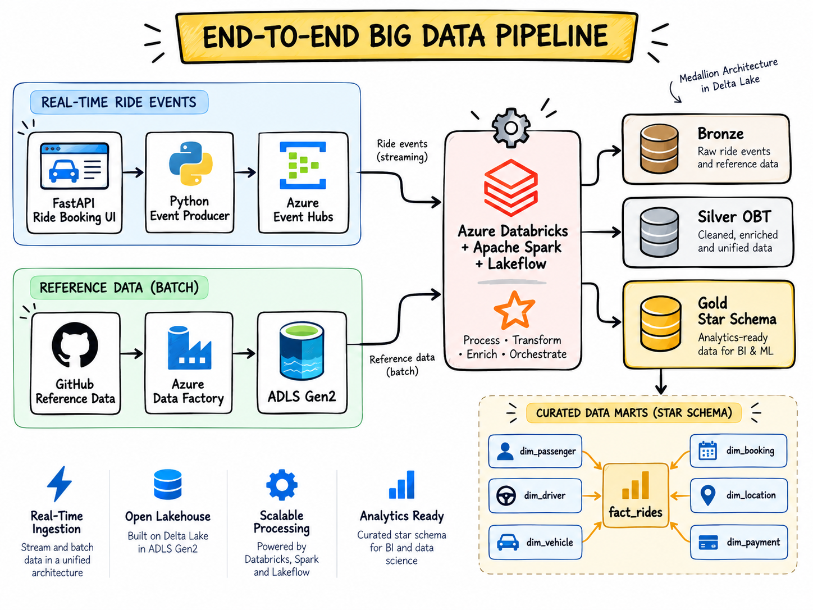
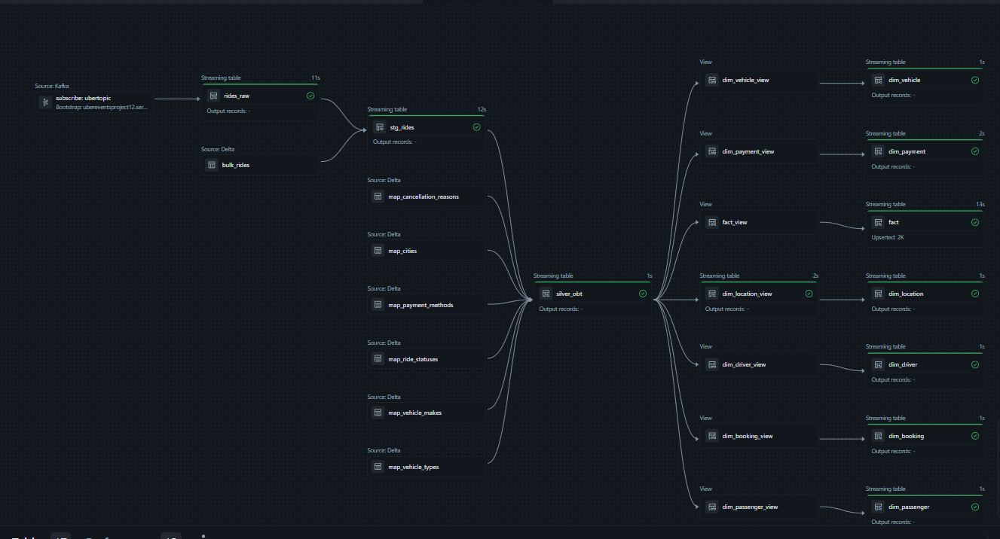
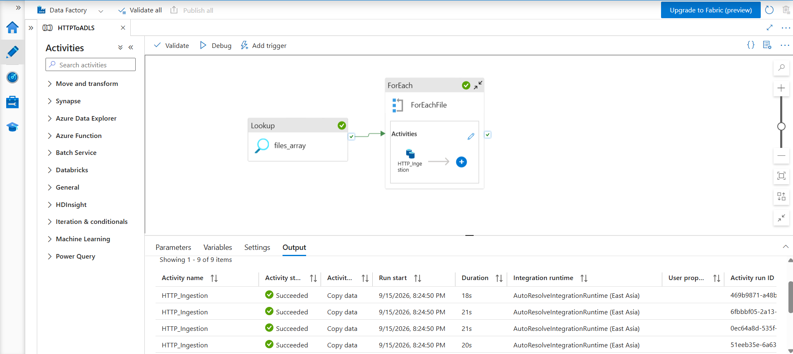
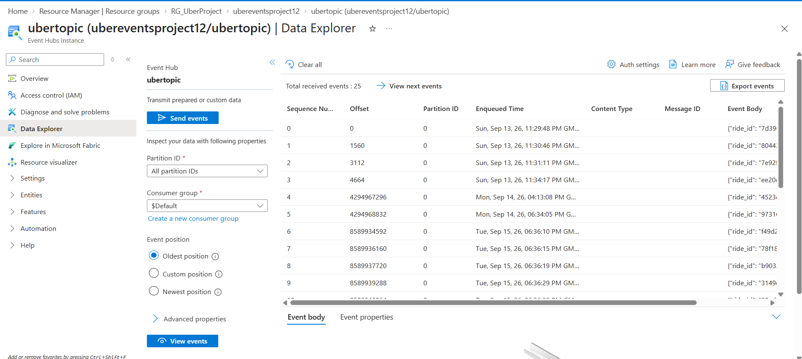
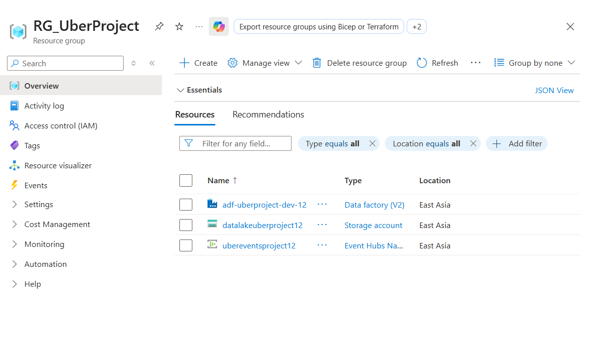

# Real-Time Big Data Streaming Lakehouse on Azure

### Azure Databricks | Apache Spark | Event Hubs | Azure Data Factory | ADLS Gen2 | Delta Lake | Lakeflow

This project implements an end-to-end **big data streaming and batch data engineering architecture on Microsoft Azure**.

A Python/FastAPI ride-booking application generates simulated ride events and sends them in real time to **Azure Event Hubs**. At the same time, reference datasets are ingested through **Azure Data Factory** using an HTTP-based ingestion pipeline and stored in **Azure Data Lake Storage Gen2**.

Azure Databricks processes both ingestion paths using **Apache Spark, PySpark, Spark Structured Streaming, Delta Lake and Lakeflow Declarative Pipelines**.

The final output is an analytics-ready **Gold Layer Star Schema** containing fact and dimension tables with **SCD Type 1 and SCD Type 2** processing.

---

## Architecture



The solution combines two ingestion paths:

- **Real-time streaming path:** FastAPI → Azure Event Hubs → Azure Databricks → Apache Spark Structured Streaming
- **Batch reference-data path:** GitHub / HTTP JSON files → Azure Data Factory → ADLS Gen2 → Databricks reference tables

Both paths converge in the **Silver One Big Table (OBT)**, where streaming ride events are enriched with reference data.

The enriched Silver data is then transformed into an analytics-ready **Gold Layer Star Schema** containing fact and dimension tables.

---

## Technology Stack

| Area | Technology |
|---|---|
| Cloud Platform | Microsoft Azure |
| Big Data Processing | Apache Spark, PySpark |
| Real-Time Streaming | Azure Event Hubs, Spark Structured Streaming |
| Data Integration | Azure Data Factory |
| Storage | Azure Data Lake Storage Gen2 |
| Lakehouse Platform | Azure Databricks |
| Table Format | Delta Lake |
| Pipeline Framework | Lakeflow Declarative Pipelines |
| Data Architecture | Bronze, Silver, Gold Medallion Architecture |
| Data Modeling | Star Schema, Fact & Dimension Tables |
| Change Processing | CDC, SCD Type 1, SCD Type 2 |
| Transformation | PySpark, Spark SQL, Jinja2 |
| Application | Python, FastAPI |
| Data Generation | Faker |
| Version Control | Git, GitHub |

---

## Data Ingestion Architecture

The project uses two separate ingestion paths: a **real-time streaming path** for ride-booking events and a **batch ingestion path** for reference datasets.

### Real-Time Streaming Path

The FastAPI application simulates ride bookings. Each booking generates a JSON ride event that is sent to Azure Event Hubs.

```text
User
  ↓
FastAPI Ride Booking UI
  ↓
Python Ride Generator
  ↓
Azure Event Hubs
  ↓
Kafka-Compatible Endpoint
  ↓
Azure Databricks
  ↓
Apache Spark Structured Streaming
  ↓
Bronze rides_raw
```

### Batch Reference Data Path

Reference datasets are ingested using Azure Data Factory.

```text
GitHub Reference JSON Files
        ↓
Azure Data Factory
        ↓
Lookup Activity
        ↓
ForEach Activity
        ↓
HTTP Copy Activity
        ↓
ADLS Gen2
        ↓
Databricks Bronze Reference Tables
```

Reference datasets include:

- Cities
- Vehicle makes
- Vehicle types
- Payment methods
- Ride statuses
- Cancellation reasons

---

## Azure Infrastructure

The Azure environment contains the core services required for ingestion, storage and processing.

```text
RG_UberProject
│
├── Azure Data Factory
│
├── Azure Storage Account / ADLS Gen2
│
├── Azure Event Hubs Namespace
│   └── ubertopic
│
└── Azure Databricks
```
---

### Azure Event Hubs

Azure Event Hubs acts as the real-time event streaming layer.

Ride events generated by the FastAPI application are serialized as JSON and published to the `ubertopic` Event Hub.

The events are consumed by Databricks through the Event Hubs Kafka-compatible endpoint.

### Azure Data Factory

Azure Data Factory handles the batch ingestion of reference datasets.

The pipeline uses:

```text
Lookup
   ↓
ForEach
   ↓
HTTP Copy
   ↓
ADLS Gen2
```

The Lookup activity reads the file configuration, while the ForEach activity dynamically ingests each reference JSON file.

### Azure Data Lake Storage Gen2

ADLS Gen2 stores the batch/reference datasets before they are processed by Databricks.

---

## Bronze Layer

The Bronze layer stores raw and minimally processed data.

### Streaming Ride Events

Azure Databricks consumes Event Hub messages using Spark Structured Streaming.

```text
Azure Event Hubs
      ↓
Kafka
      ↓
rides_raw
```

The Kafka `value` field is converted into a JSON string and stored in the `rides_raw` streaming table.

### Reference Data

Reference datasets are loaded into Delta tables such as:

```text
map_cities
map_vehicle_makes
map_vehicle_types
map_payment_methods
map_ride_statuses
map_cancellation_reasons
```

---

## Streaming Staging Layer

The raw JSON ride events are parsed using a predefined PySpark schema.

```text
rides_raw
    ↓
from_json()
    ↓
stg_rides
```

The `stg_rides` streaming table combines:

```text
uber.bronze.bulk_rides
          +
Real-Time rides_raw
          ↓
      stg_rides
```

Lakeflow append flows are used to combine both sources into the same streaming table.

---

## Silver Layer — One Big Table

The Silver layer enriches ride events with reference data.

```text
stg_rides
     +
map_vehicle_makes
     +
map_vehicle_types
     +
map_ride_statuses
     +
map_payment_methods
     +
map_cities
     +
map_cancellation_reasons
     ↓
silver_obt
```

The resulting `silver_obt` table contains enriched ride, passenger, driver, vehicle, payment, location and fare information.

A watermark is used on `booking_timestamp` to manage late-arriving streaming events.

---

## Metadata-Driven SQL Generation

The Silver transformation also demonstrates metadata-driven SQL generation using Jinja2.

Instead of manually maintaining a large SQL statement, table names, selected columns and join conditions are stored in configuration objects.

```text
Jinja Configuration
       ↓
Jinja Template
       ↓
Generated Spark SQL
       ↓
Silver OBT
```

This makes the transformation logic easier to maintain and extend.

---

## Gold Layer

The Gold layer converts the enriched Silver OBT into an analytics-ready dimensional model.

The project creates:

```text
dim_passenger
dim_driver
dim_vehicle
dim_payment
dim_booking
dim_location
fact
```

### SCD Type 1

SCD Type 1 is used for dimensions where only the latest version of a record is required.

Examples:

```text
dim_passenger
dim_driver
dim_vehicle
dim_payment
dim_booking
```

### SCD Type 2

`dim_location` uses SCD Type 2 to preserve historical changes.

The location dimension therefore maintains both current and previous versions of changed records.

---

## Star Schema

The final analytical model follows a Star Schema.

```text
                 dim_passenger
                       |
                       |
dim_driver -------- fact -------- dim_vehicle
                       |
                       |
                 dim_payment
                       |
                 dim_booking
                       |
                 dim_location
```

The fact table contains ride-level measures such as:

```text
distance_miles
duration_minutes
base_fare
distance_fare
time_fare
surge_multiplier
total_fare
tip_amount
rating
```

---

## Databricks Lakeflow Pipeline

The complete Databricks pipeline combines streaming ride data with Delta reference tables, creates the Silver OBT, and generates the Gold dimensional model.



## Pipeline Execution Evidence

### Azure Data Factory

The batch ingestion pipeline reads the reference-file configuration using a Lookup activity, iterates through each dataset using ForEach, and copies the HTTP source data into ADLS Gen2.

The successful execution below shows the reference datasets being ingested through the `HTTP_Ingestion` Copy activity.



### Azure Event Hubs

Ride events generated by the FastAPI application are published to Azure Event Hubs and consumed by the Databricks streaming pipeline.



### Azure Resources

The project uses Azure Data Factory, ADLS Gen2, Azure Event Hubs and Azure Databricks.



---

## Repository Structure

```text
azure-bigdata-streaming-lakehouse/
│
├── README.md
├── requirements.txt
├── .gitignore
├── .env.example
├── LICENSE
│
├── application/
│   ├── api.py
│   ├── eventhub_producer.py
│   ├── ride_generator.py
│   └── templates/
│       ├── home.html
│       └── confirmation.html
│
├── azure-data-factory/
│   ├── files_array.json
│   ├── pipelines/
│   │   └── HTTPToADLS.json
│   └── datasets/
│       ├── ds_files_array.json
│       ├── ds_github.json
│       └── ds_ingest.json
│
├── databricks/
│   ├── bronze/
│   │   ├── reference_data_ingestion.py
│   │   └── eventhub_ingestion.py
│   ├── silver/
│   │   ├── silver_streaming.py
│   │   ├── obt_query_generator.py
│   │   └── silver_obt.sql
│   └── gold/
│       └── dimensional_model.py
│
├── data/
│   ├── map_cities.json
│   ├── map_cancellation_reasons.json
│   ├── map_payment_methods.json
│   ├── map_ride_statuses.json
│   ├── map_vehicle_makes.json
│   └── map_vehicle_types.json
│
└── docs/
    ├── architecture_overview.png
    ├── databricks_pipeline_graph.png
    ├── adf_pipeline_success.png
    ├── eventhub_stream.png
    └── azure_resources.png
```

---

## How to Run

### 1. Configure the application

Create a `.env` file:

```text
CONNECTION_STRING=<YOUR_EVENT_HUB_CONNECTION_STRING>
EVENT_HUBNAME=<YOUR_EVENT_HUB_NAME>
```

Install dependencies:

```bash
pip install -r requirements.txt
```

Start the FastAPI application:

```bash
python application/api.py
```

Open:

```text
http://127.0.0.1:8000
```

Creating a ride from the UI generates a simulated ride event and publishes it to Azure Event Hubs.

### 2. Run the Azure Data Factory pipeline

Run the `HTTPToADLS` pipeline to ingest the reference JSON datasets into ADLS Gen2.

The pipeline performs:

```text
Lookup
  ↓
ForEach
  ↓
HTTP Copy
  ↓
ADLS Gen2
```

### 3. Run the Databricks pipeline

The Databricks Lakeflow pipeline:

```text
Event Hubs
    ↓
rides_raw
    ↓
stg_rides
    ↓
silver_obt
    ↓
Gold Dimensions + Fact Table
```

---

## Security

Secrets and credentials are not stored in the repository.

The following should never be committed:

- Azure Event Hubs connection strings
- Shared Access Keys
- ADLS SAS tokens
- Databricks credentials
- `.env` files

Environment variables are used for application secrets.

Example:

```python
CONNECTION_STRING = os.getenv("CONNECTION_STRING")
EVENT_HUBNAME = os.getenv("EVENT_HUBNAME")
```

---

## Key Engineering Concepts

This project demonstrates:

- Big data processing with Apache Spark
- PySpark transformations
- Spark Structured Streaming
- Azure Event Hubs streaming
- Kafka-compatible ingestion
- Azure Data Factory orchestration
- HTTP-based batch ingestion
- ADLS Gen2 storage
- Delta Lake
- Lakeflow Declarative Pipelines
- Bronze, Silver and Gold Medallion Architecture
- Batch and streaming integration
- Explicit streaming schemas
- Watermarking
- Stream-static joins
- One Big Table modelling
- Jinja2 metadata-driven SQL generation
- Change Data Capture
- SCD Type 1
- SCD Type 2
- Fact and dimension tables
- Star Schema modelling

---

## Future Improvements

Possible enhancements include:

- Azure Key Vault for secret management
- Terraform or Bicep for Infrastructure as Code
- Databricks Asset Bundles
- CI/CD with GitHub Actions
- Lakeflow data-quality expectations
- Streaming monitoring and alerting
- Unity Catalog governance
- Power BI dashboards
- MLflow integration
- Real-time ML inference

---

## Project Summary

This project demonstrates an end-to-end Azure big data platform that combines:

```text
Real-Time Streaming
        +
Batch Ingestion
        +
Distributed Processing
        +
Lakehouse Architecture
        +
Dimensional Modelling
```

The complete lifecycle is:

```text
Generate
   ↓
Ingest
   ↓
Stream
   ↓
Store
   ↓
Transform
   ↓
Enrich
   ↓
Model
   ↓
Serve
```

